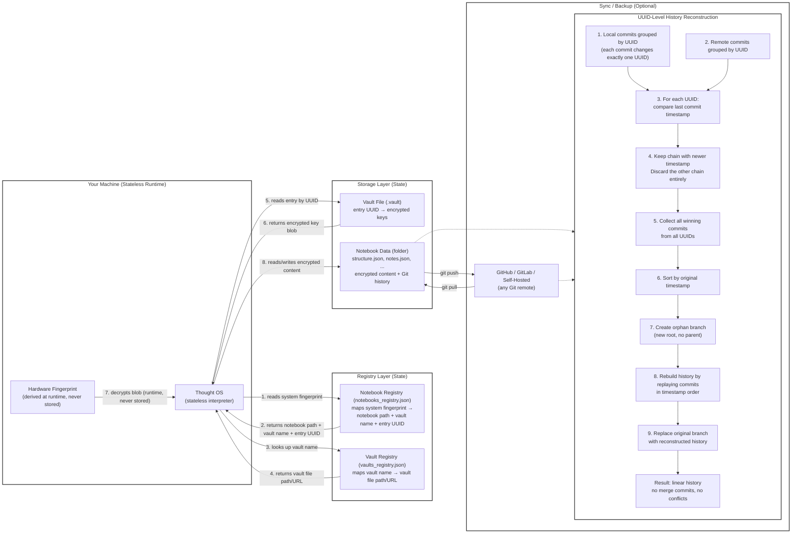

# 📓 Thought OS

> A terminal-based writing environment to think, write and sync (via github). It requires only python 3.13, git and any terminal editor like nvim/micro/vim. It needs no learning curve and git knowledge.
---
*text-based screenshots*
```

                                 Root Notebooks

No notebooks yet.

Create your first notebook to get started!

or

Press [M] to import existing from remote

[C]reate  [M]anage  [Q]uit

>
```
```

                            Create / Import Notebook

1. Default location (notebooks_root/)
   → Quick creation in app's default directory

2. External location (USB/Network drive) 🔒 MORE SECURE
   → Choose any folder on your system
   → Perfect for encrypted notebooks on USB drives
   → Easy to backup, sync with cloud, or store on encrypted drive

3. Import existing notebook
   → Load an existing Thought OS notebook from local path
   → Must contain structure.json and Git history

4. Import from Git URL
   → Clone and import a notebook from GitHub/GitLab/Bitbucket
   → Enter repository URL (must end with .git)
   → Will prompt for account credentials if needed


Choose [1-4] or Enter to cancel: 1
```
```

────────────────────────────────────────────────────────────
  YOUR RECOVERY PHRASE
────────────────────────────────────────────────────────────

  abstract asset offer fiber attend earth reopen walnut

  Store this phrase safely!

  • Write it down on paper
  • Save it in a password manager
  • Take a photo (store securely)

  [Y] Yes, I've saved it  [C] Copy to clipboard

  > y

  Press Enter when you have written it down.


  Notebook created successfully!
   Name: aa
   Folder: aa-20262609002928
   Location: /home/user/thought-os/notebooks_root/aa-20262609002928
   🔐 Encrypted with password + recovery phrase
   Recovery phrase saved - store it safely!

Press Enter to continue...
```
```

                                 Root Notebooks

[1] 🔒 my-project
[2] 🔐 thought os (10 notes, 7 files, 1 sub)

[C]reate  [V]iew  [S]earch  [D]elete  [L]ock  [M]anage  [Q]uit

> l1

  ❌ Vault file not found: /home/user/thought-os/config/session.vault
     This notebook uses the default vault.
     This notebook requires the vault file to unlock.
     Please insert the USB drive or locate the vault file.

  Options:
    1) Retry (I've inserted the USB drive)
    2) Locate vault file manually
    3) Use recovery phrase (will create new vault)
    4) Cancel

  Choose [1-4]:1
```
```

     .../[1]depth05/[2]depth06/[3]depth07/[4]depth08/[5]depth09/[6]depth10/

Notes & Files: (2 notes, 4 files)
[1] regular_internal_note                               [Updated: Jun 08 19:28]
[2] regular_external_note                               [Updated: Jun 08 19:28]
[3] lorem.md                                            [Updated: Jun 08 19:29]
[4] Dockerfile                                          [Updated: Jun 08 20:05]
[5] research.tex                                        [Updated: Jun 08 20:05]
[6] .bashrc                                             [Updated: Jun 08 20:06]

Sub-notebook: (1 sub)
[7] View Sub-notebook =>

[C]reate  [V]iew  [D]elete  [A]ctivity  [B]ack  [J]ump  [Q]uit

>v3
```
```

                               [1]thought-os/

File Name: lorem.md [.md file]
Created: Jun 11  Updated: Jun 11 21:20

Lorem Ipsum is simply dummy text of the printing and typesetting industry.
Lorem Ipsum has been the industry's standard dummy text ever since 1966,
when designers at Letraset and James Mosley, the librarian at St Bride
Printing Library, took a 1914 Cicero translation and scrambled it to make
dummy text for Letraset's Body Type sheets. It has survived not only many
decades, but also the leap into electronic typesetting, remaining
essentially unchanged. It was popularised thanks to these sheets and more
recently with desktop publishing software including versions of Lorem Ipsum.
Contrary to popular belief, Lorem Ipsum is not simply random text. It has
roots in a piece of classical Latin literature from 45 BC, making it over
2000 years old. Richard McClintock, a Latin professor at Hampden-Sydney
College in Virginia, looked up one of the more obscure Latin words,

                                  Page 1 of 2    >>

[E]dit  [V]iew  [X]port  [T]imeline  [R]ename  [B]ack  [N]ext  [Q]uit

>
```
```

                              Timeline: 4 versions

[1] 2026-06-09 00:13 [RENAMED] note  → note_renamed
[2] 2026-06-09 00:09 [RESTORED]
[3] 2026-06-09 00:09 [DELETED]
[4] 2026-06-09 00:06 [UPDATED] 6(+) 0(-)

[V]iew  [B]ack

>v2
```
```

                         Activity: aa and subnotebooks

[1] erased file: scipt.sh                                                [root]
[2] renamed note: regular_internal_note → regul...        [.../depth09/depth10]
[3] updated file: lorem.md   65(+) 3(-)                   [.../depth09/depth10]
[4] updated file: index.html 5(+) 5(-)                    [.../depth09/depth10]
[5] restored note: regular_internal_note                  [.../depth09/depth10]
[6] deleted note: regular_internal_note                   [.../depth09/depth10]
[7] erased note: regular_external_note                    [.../depth09/depth10]
[8] updated note: regular_internal_note 6(+) 0(-)         [.../depth09/depth10]
[9] created sub: depth11                                  [.../depth10/depth11]
[10] created file: .bashrc 178(+)                                        [root]

[V]iew  [B]ack   [Q]uit

>v3
```
```

                              Change Options - aa


  [1] Change password
  [2] Change Autolock status
  [3] Change remote location
  [4] Change trusted device status
  [5] Change vault location

  Press Enter to cancel

  Choose:5
```
```
  ✓ Looking for updates - complete

  Status: Local and remote have diverged history.

  • Commits only in local: 1
  • Commits only in remote: 3
  • Conflicting UUIDs (newer chain wins): 15

  What will happen:
  • Reconstruct linear history from 70 commits
  • Commits ordered by original timestamps
  • Newer chain kept for conflicting UUIDs
  • All commits preserved, linear timeline
  • Remote history will be replaced (force push)

  Proceed? [y/N]: y
  Reconstructing linear history from all commits...
  Pushing reconstructed history... OK

  Sync complete! Linear history reconstructed.

  Press Enter to continue...
```
```
꘎ SECURELY ERASING ENTIRE NOTEBOOK: aa
  This will DELETE ALL COMMITS and remove the folder permanently!

  Repository: /home/user/thought-os/notebooks_root/aa-20262607180201

  Enter notebook password to confirm erasure (3 attempts):
```
---

---

## Search (from main app)

| Command | Description |
|---------|-------------|
| `s query` | Search **all** notebooks |
| `s created*` | Show all created notes |
| `s deleted*` | Show deleted notes (restorable) |
| `s in* notebookname` | Search inside a specific notebook |
| `s date* 15-05-2026` | Filter by exact date |
| `s today*` | Today’s changes |
| `s thisweek*` | This week’s activity |
| `s created* file* in* projects` | Created files inside the "projects" notebook |
## Search (from notebook)
| Command | Description |
|---------|-------------|
| `s query` | Search current notebook
| `s g* query` | Search **all** notebooks |
| `s g* any-query` | Search **all** notebooks |


**💡 Tips:**
- `j1`, `j2`, `jb` → jump between notebooks
- `l` → lock / unlock encrypted notebooks
- `b` → back
- `q` → quit
- `s` → search
---
*A fact – my app itself has no name printed except on documents, like an app with no name. I could not find a place to put it and it is not needed inside the environment.*

*The entire GitHub repository with all its source code and documentation are explicitly part of the prior art (Public + timestamped + enabling)*

*`The rest is explained in documentations`*

---

## 📦 1. Requirements

- **Python 3.13** (any version for installed cffi and cryptography)
- **Git** (for history, timeline, restoration)
- **No pip install needed** (cryptography is bundled in `assets/`)
- **nvim / micro** (configurable via config.json)
- **Linux / Windows / Mac** (designed to run on any OS)

(tested only on Debian Linux 13)

---

## 🚀 2. Executables

`thought_os.py`


**Run from project folder:**

```bash
python3 thought_os.py
```
or
```bash
git clone https://github.com/sjyotis/thought-os.git
cd thought-os
chmod 700 thought_os.py
./thought_os.py
```
**single command**
```bash
git clone https://github.com/sjyotis/thought-os.git && cd thought-os && python3 thought_os.py
```
`email : thought-os@protonmail.com`
