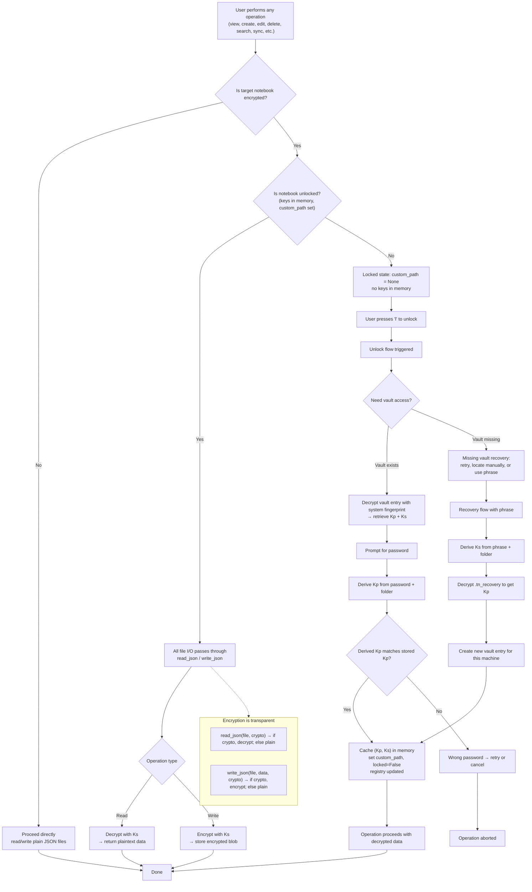

# Prior Art Disclosure: Thought OS Encryption System

## A Complete Technical Description of a Flexible, Dual-Key, Hardware-Bound, Portable Encryption Architecture with Zero-Configuration, Cross-Platform Deployment, Explicit Memory Management, and Active Vault Validation

---

**Date of Disclosure:** June 2026  
**Author:** sjyotis  
**Status:** Public, Timestamped, Irrevocable  
**Repository:** [github.com/sjyotis/thought-os](https://github.com/sjyotis/thought-os)

---

## Table of Contents

1. Introduction
2. The Encryption System in One Flowchart
3. Step-by-Step Explanation of the Flowchart
4. Summary of Disclosed Concepts
5. Cryptographic Primitives and Bundled Distribution
6. Key Derivation
7. The Three Keys
8. Flexible Phrase System
9. File Structure
10. Hardware-Bound Key Storage
11. Dual-Key Authentication
12. The Lock Button: Visual Encryption Status and Explicit Memory Manager
13. Active Vault Validation and Missing Vault Recovery
14. Portable Secure Session Vaults (Custom Locations)
15. Trusted Devices Management
16. Recovery Mechanism
17. Password Change Without Re-encryption
18. No Phrase Storage
19. Git as Encrypted Sync Layer
20. Portability and Zero-Configuration Deployment
21. Encryption Overhead
22. Docker / Cloud Ephemeral Fingerprinting
23. How the System Was Built: The Logic Chain
24. Prior Art Assertion
25. US and European Patent Law Compliance
26. Conclusion

---

## 1. Introduction

This document describes the encryption architecture implemented in Thought OS, a local-first, terminal-based writing system. The system is built on standard cryptographic primitives (AES-256-GCM, SHA256) but employs a novel key management architecture that:

- Separates authentication from encryption
- Uses a flexible phrase system (any length, any words, any text)
- Binds keys to hardware without a TPM
- Enables recovery without cloud services
- Allows instant password changes
- Provides free encrypted sync via Git
- Bundles cross-platform cryptography libraries for zero-configuration deployment
- Uses a single lock symbol (🔒/🔐) as the complete encryption interface
- Implements the lock button as an **explicit memory manager** that unloads encryption keys and notebook structure from RAM
- **Actively validates vault existence before every cache hit**
- **Supports portable vault files stored anywhere (local, USB, network, cloud)**
- **Provides trusted device management and revocation**

The purpose of this disclosure is to establish prior art under 35 U.S.C. § 102(a)(1). The concepts described herein are now part of the public domain. No party may obtain valid patent claims covering any concept disclosed.

---

## 2. The Encryption System in One Flowchart

The following flowchart shows **exactly what happens when any operation is performed** – it is the complete user‑visible flow of the encryption system.



This flowchart captures **every operation** – read, write, view, create, edit, delete, search, sync, lock, unlock, recovery, password change – in a single, consistent model.

---

## 3. Step‑by‑Step Explanation of the Flowchart

### 3.1. Any Operation Starts Here
**Node A:** The user performs any action (view, create, edit, delete, search, sync, etc.).  
**Node B:** The system checks if the target notebook is encrypted.

- **If No (Node C):** All operations proceed directly with plaintext JSON files. No encryption is involved.

- **If Yes (Node D):** The system checks if the notebook is unlocked.

### 3.2. Unlocked State
**Node D → Yes:** The notebook is unlocked – keys are in memory and `custom_path` is set.  
**Node E:** All file I/O goes through the universal handlers `read_json` / `write_json`.  
**Node F:** The operation type determines the action:

- **Read (Node G):** The file is decrypted with the **Phrase Key (Ks)** and returns plaintext data.
- **Write (Node H):** The data is encrypted with **Ks** and stored as an encrypted blob.

**Node Z:** The operation completes.

**Key Insight:** In the unlocked state, encryption/decryption happens **automatically and transparently** at the file boundary. The operation itself does not need to be aware of encryption.

### 3.3. Locked State
**Node D → No:** The notebook is locked – `custom_path = None` and no keys are in memory.  
**Node I:** The system shows the locked state (🔒). The notebook cannot be accessed.

**Node J:** The user presses the lock button (`l`) to unlock.  
**Node K:** Unlock flow is triggered.

### 3.4. Unlock Flow
**Node L:** The system needs to access the vault (where encrypted keys are stored).

- **If Vault Exists (Node M):** The system decrypts the vault entry using the system fingerprint (derived at runtime, never stored) to retrieve the stored `Kp` (password key) and `Ks` (phrase key).

- **If Vault Missing (Node N):** The system triggers the **missing vault recovery** flow:
  - User can retry (after inserting the missing device)
  - Locate the vault file manually
  - Use the recovery phrase to recreate the vault entry

**Node O:** The system prompts the user for their password.  
**Node P:** The system derives `Kp` from the entered password and the folder name.  
**Node Q:** The derived `Kp` is compared with the stored `Kp` from the vault.

- **If Yes (Node R):** The keys are cached in memory, `custom_path` is set, `locked=False` is written to the registry, and the operation proceeds with decrypted data.
- **If No (Node T):** Wrong password – user retries or cancels; operation is aborted (Node U).

### 3.5. Recovery Flow (First Use on New Machine, or After Vault Loss)
**Node V:** The user enters the recovery phrase.  
**Node W:** The system derives `Ks` from the phrase and folder name.  
**Node X:** The system decrypts `.tn_recovery` using `Ks` to retrieve `Kp`.  
**Node Y:** The system creates a new vault entry for this machine (encrypted with the current system fingerprint) and updates the registry.  
**Node R:** The keys are cached and the notebook is unlocked.

### 3.6. Transparent Encryption
The **Transparent** subgraph shows that `read_json` and `write_json` are the only points where encryption/decryption occurs. If a `Crypto` object is present, they encrypt/decrypt; otherwise, they handle plaintext. All higher‑level operations (view, edit, search, sync) are identical regardless of encryption state – they work on plaintext data after the initial unlock.

---

## 4. Summary of Disclosed Concepts

| Concept | Description |
|---------|-------------|
| **Bundled Cross-Platform Cryptography** | Cryptography libraries bundled for Linux, macOS, Windows. No external installation required. |
| **Flexible Phrase System** | 6–24 random words OR any custom text (poems, stories, sentences) |
| **Dual-Key Separation** | Password key for daily authentication, phrase key for encryption |
| **Hardware-Bound Key Storage Without TPM** | Keys encrypted with system fingerprint derived at runtime; fingerprint never stored |
| **Cross-Encrypted Key Files** | Three files: `.tn_test`, `.tn_recovery`, `.tn_password` |
| **Lock Button as Visual Status** | Single key (`l`) toggles between 🔒 and 🔐. The symbol is the complete interface. |
| **Lock Button as Explicit Memory Manager** | Locking removes keys from memory AND unloads the entire notebook structure from RAM. |
| **Active Vault Validation** | `SessionKeyVault` validates vault file existence before every cache hit; missing vault invalidates cache immediately. |
| **Missing Vault Recovery** | User prompted with options: retry, locate manually, or use recovery phrase. |
| **Portable Vault Files** | Vault files can be stored on any reachable location: local disk, USB, network share, S3 bucket, WebDAV server. |
| **Vault Registry** | `vaults_registry.json` maps vault names to absolute paths or URLs. |
| **Trusted Devices Management** | UI lists all trusted machines; user can remove any entry, including current machine (immediately locks notebook). |
| **Instant Password Change** | Password change without re‑encrypting the notebook. |
| **No Phrase Storage** | Recovery phrase shown once, never stored or hashed. |
| **Git as Encrypted Sync** | Encrypted JSON blobs pushed to any Git remote (including public repos). |
| **Folder Name as Salt** | Folder name used in all key derivations; renaming folder locks data permanently. |
| **Portable Notebook Folder** | Self‑contained encrypted folder, importable on any machine with phrase. |
| **Zero‑Configuration** | Single executable, bundled dependencies, runs on any system with no setup. |
| **Docker / Cloud Ephemeral Fingerprinting** | Hardware fingerprint derived from container environment; entries become undecryptable when container destroyed. |

---

## 5. Cryptographic Primitives and Bundled Distribution

The system uses only standard, well‑audited cryptographic primitives:

| Component | Algorithm | Source |
|-----------|-----------|--------|
| **Encryption** | AES-256-GCM | `cryptography` library |
| **Key Derivation** | SHA256 | Python `hashlib` |
| **Randomness** | `os.urandom` | Operating system CSPRNG |
| **Key Storage** | AES-256-GCM | Encrypted with system fingerprint (derived at runtime, never stored) |

### Bundled Cross‑Platform Distribution

The cryptography libraries are bundled with the application to achieve zero‑configuration deployment:

- No `pip install` required
- No system dependencies (OpenSSL, libffi)
- Works on any system with Python 3.6+ (3.13 for bundled setup)
- Cross‑platform support: Linux, macOS, Windows
- Single executable output includes all dependencies

---

## 6. Key Derivation

All keys are derived using SHA256 with a secret and a salt:

```python
def derive_key(secret, salt):
    combined = secret + b':' + salt
    return hashlib.sha256(combined).digest()
```

- **Secret:** User password or recovery phrase (any length, any text)
- **Salt:** Notebook folder name (e.g., `"my-notes-20260401123456"`)

**Properties:**
- Same secret on different notebooks yields different keys
- SHA256 output is always 256 bits, regardless of secret length
- No secret is ever used directly
- The salt is public (folder name) but ensures uniqueness
- **Renaming the folder changes the salt, permanently locking the data**

---

## 7. The Three Keys

The system maintains three keys per notebook:

| Key | Derivation | Purpose | Storage |
|-----|------------|---------|---------|
| **Password Key (Kp)** | SHA256(password + folder) | Daily authentication | Encrypted in `.tn_recovery` with Ks |
| **Phrase Key (Ks)** | SHA256(phrase + folder) | Actual encryption key | Never stored (derived on demand) |
| **Combined Key (Kc)** | SHA256(Kp + Ks) | Verification | Self‑referential in `.tn_password` |

**Notebook data (structure.json, notes.json, files.json) is always encrypted with Ks.** The password key is never used for encryption. Kp only unlocks the cached key on a trusted machine.

---

## 8. Flexible Phrase System

The system accepts any phrase as the ultimate key:

### Auto‑Generated Phrases (BIP‑39 Style)

| Length | Entropy | Security Level |
|--------|---------|----------------|
| 6 words | 66 bits | 2,000 years to crack |
| 8 words | 88 bits | Stronger than most corporate passwords |
| 12 words | 132 bits | Bitcoin standard, unbreakable |
| 16 words | 176 bits | Extremely secure |
| 20 words | 220 bits | Paranoid level |
| 24 words | 264 bits | Beyond any known computational limit |

### Custom Phrases (User‑Provided)

The user can enter any text as their recovery phrase: a sentence, a poem, a story, any combination. Any length, any content, case‑sensitive, no word list restrictions.

**The key remains 256 bits regardless of phrase length.** The phrase selects one of 2^256 possible keys. The entropy of the phrase determines how hard it is to guess which key is used.

---

## 9. File Structure

Each encrypted notebook folder contains:

```
notebook_folder/
├── structure.json      # Notebook structure, encrypted with Ks
├── notes.json          # Note content, encrypted with Ks
├── files.json          # File content, encrypted with Ks
├── .tn_test            # "VERIFICATION" encrypted with Ks
├── .tn_recovery        # Kp encrypted with Ks
└── .tn_password        # Kc encrypted with Kc (self‑referential)
```

**No file contains unencrypted secrets.** All are raw encrypted binary blobs.

---

## 10. Hardware-Bound Key Storage Without TPM

Keys are cached in a secure session vault file, encrypted with a key derived from:

```
entry_key = SHA256(timestamp + system_fingerprint)
```

The system fingerprint is derived at runtime from machine identifiers and **never stored**:

| Platform | Identifiers |
|----------|-------------|
| Linux | `/etc/machine-id`, product UUID, CPU info |
| macOS | IOPlatformUUID, hardware serial number |
| Windows | MachineGUID, ComputerName, user SID |
| Fallback | hostname, username, platform info, file paths |

**Properties:**
- Keys cannot be decrypted on a different machine
- Copying the notebook folder to another machine requires the recovery phrase
- The same notebook can be used on multiple machines by importing with the phrase on each
- No TPM required

---

## 11. Dual-Key Authentication

The system separates authentication from encryption:

### Daily Use (Trusted Machine)

1. User enters password
2. System derives Kp from password + folder
3. `SessionKeyVault` retrieves cached Crypto object (validates vault exists)
4. System derives Kc and verifies `.tn_password`
5. Notebook decrypts with Ks

**The phrase is never entered during daily use.**

### First Use on New Machine

1. User copies notebook folder to new machine
2. User enters phrase (once)
3. System derives Ks
4. System decrypts `.tn_recovery` to retrieve Kp
5. System derives Kc and verifies `.tn_password`
6. System creates new vault entry encrypted with the new machine's hardware fingerprint
7. Master registry updated with new system fingerprint, vault name, and entry UUID
8. Future unlocks require only password

**The phrase is only needed once per machine.**

---

## 12. The Lock Button: Visual Encryption Status and Explicit Memory Manager

The lock button serves two critical functions: visual encryption status and explicit memory management.

### Visual Representation

| State | Symbol | Meaning |
|-------|--------|---------|
| **Locked** | 🔒 | Notebook encrypted, keys not in memory, structure unloaded, cannot access |
| **Unlocked** | 🔐 | Notebook decrypted, keys in memory, structure loaded, full access |
| **Unencrypted** | (no symbol) | Notebook not encrypted |

### User Interaction

Single key press (`l`) toggles the lock state:
- Press `l` on a locked notebook → prompts for password, unlocks
- Press `l` on an unlocked notebook → clears keys from memory, unloads structure, locks

### The Lock Button as Explicit Memory Manager

When the user locks a notebook:
- `notebook.custom_path = None`
- Encryption keys deleted from `session_keys` cache
- `SessionKeyVault` cache cleared
- Notebook structure (notes, subnotebooks) unloaded
- Crypto object deleted

**What remains:** registry entry (encrypted), notebook folder on disk, vault file (keys encrypted with hardware fingerprint).

**Why this matters:** The lock button is an **explicit memory manager**. The user controls when to unload a notebook, clearing working memory and keys.

---

## 13. Active Vault Validation and Missing Vault Recovery

The `SessionKeyVault` is a transparent dict-like cache that validates the existence of the underlying vault file **before every cache hit**:

```python
def __getitem__(self, notebook_id):
    if notebook_id in self._cache:
        vault_path = self.manager._get_vault_path(notebook_id)
        if vault_path and os.path.exists(vault_path):
            return self._cache[notebook_id]
        else:
            del self._cache[notebook_id]   # invalidate immediately
    # fall back to reading from vault
```

If the vault file is missing (USB unplugged, network share unmounted, file deleted), the cached entry is deleted instantly. Subsequent operations fail cleanly or trigger recovery.

### Missing Vault Recovery Flow

When the system detects a missing vault during key resolution, it presents the user with options:

1. **Retry** – after inserting the missing device
2. **Locate vault file manually** – update registry with new location
3. **Use recovery phrase** – recreate the vault entry (will create new vault if needed)
4. **Cancel** – abort operation

The system can recover from loss of any single component (vault file, notebook folder, app instance) using the recovery phrase.

---

## 14. Portable Secure Session Vaults (Custom Locations)

The secure session vault is no longer fixed to a single location. A `VaultManager` maintains a registry (`vaults_registry.json`) that maps a vault name to an absolute path or URL.

Users can:
- Create new vaults at any location (local disk, USB, network share, cloud bucket, WebDAV server)
- Select an existing vault for a notebook
- Switch a notebook from the default vault to a custom vault, and back

Each notebook stores its associated vault identifier in the master registry entry. The `SessionKeyVault` transparently resolves the correct vault file path.

Because entries are encrypted with the hardware fingerprint, the vault file can be placed on **untrusted cloud storage** without revealing the keys.

---

## 15. Trusted Devices Management

The secure session vault stores per-machine entries including:
- `timestamp` (creation time)
- `nonce` and `encrypted_keys` (the key material)
- `active` flag for the current machine
- `system_name` (hostname) – human-readable identifier

The system provides a user interface (`_show_trusted_devices`) that:
- Lists all trusted devices for a notebook
- Marks the current active device
- Allows the user to **remove any entry**, including the current machine's own entry

Removing the current machine's entry immediately locks the notebook, clears all cached keys, and removes the system from the vault. The notebook can only be unlocked again using the recovery phrase.

No central server is involved. This provides a **decentralized, offline-first device revocation mechanism**.

---

## 16. Recovery Mechanism

If the password is forgotten:

1. User enters phrase on any machine
2. System derives Ks
3. System decrypts `.tn_recovery` to retrieve Kp
4. System has both keys, can decrypt notebook
5. User sets new password (updates `.tn_recovery`, `.tn_password`, vault entry)

**Recovery works on any machine, even if the original vault file is lost.** Requires no cloud, no email, no central authority.

---

## 17. Password Change Without Re-encryption

Changing password does not re-encrypt the notebook:

1. User enters old password (verifies Kp)
2. User enters new password
3. System derives new Kp'
4. System updates `.tn_recovery` with new Kp' (still encrypted with Ks)
5. System updates `.tn_password` with new Kc'
6. System updates vault entry (re-encrypts the same Kp+Ks with existing hardware fingerprint, keeping same entry UUID)

**The notebook remains encrypted with Ks (unchanged).** Password change is instant regardless of notebook size.

---

## 18. No Phrase Storage

The recovery phrase is:
- Generated once (if auto-generated)
- Shown once
- Never written to disk
- Never hashed
- Never saved in any form

**The user alone owns the phrase. The system cannot recover it. The system cannot lose it.**

---

## 19. Git as Encrypted Sync Layer

Because all files are encrypted binary blobs:
- Any Git remote works (GitHub, GitLab, self-hosted)
- Public repositories are safe (JSON is encrypted)
- No separate sync service needed
- No subscription required

**Git becomes a free, encrypted sync infrastructure.**

---

## 20. Portability and Zero-Configuration Deployment

The application is distributed as:
- **Source code** – Python files with bundled assets
- **Linux executable** – Single file, no dependencies
- **Windows executable** – Single file, bundled editors
- **Docker container** – Multi-user, SSH-enabled
- **USB drive** – Copy folder, run anywhere

**Properties:** No installation, no system dependencies, no configuration files, no environment variables, no admin privileges needed.

---

## 21. Encryption Overhead

Each encrypted file uses:
- 12 bytes nonce (random per encryption)
- 16 bytes GCM authentication tag
- Total overhead: **28 bytes per file**

No base64 encoding. No JSON wrappers. No metadata headers.

---

## 22. Docker / Cloud Ephemeral Fingerprinting

Because the hardware fingerprint is derived at runtime from the execution environment, the same code can run inside a Docker container or a cloud VM. The container's fingerprint is based on its container ID, network stack, hostname, and other ephemeral identifiers.

When the container is destroyed, the fingerprint is lost. Any vault entries created for that container become undecryptable. This makes the system suitable for **ephemeral, stateless workloads**.

Users can:
- Run the application in a Docker container on any cloud provider
- Store the vault file on a separate network share or object storage (S3, Backblaze, WebDAV)
- Store the notebook data in a public Git repository

The three components can reside on three different cloud services. The system resolves the vault URL via the vault registry, fetches it over HTTPS, decrypts using the container's runtime fingerprint, and performs the operation – **all without trusting the cloud provider**.

---

## 23. How the System Was Built: The Logic Chain

This system was not designed from theory. It emerged from answering questions, each step following logically from the previous:

1. **What do I need?** Privacy. Only I can read my notes.
2. **What do I have?** A laptop. A folder. A user who will type something daily.
3. **What is the problem with passwords?** Weak. Reused. Forgotten.
4. **What if the password isn't the key?** Let password unlock the real key. The real key should be something stronger.
5. **What is a strong key?** A recovery phrase. Like Bitcoin. 12 random words. Unbreakable.
6. **But I can't type 12 words every day.** So use password daily. Phrase only for recovery and import.
7. **What about the folder name?** Use it as salt. Same phrase on different notebooks = different keys.
8. **What if I don't want random words?** Let users write anything. A poem. A story. A memory.
9. **How do I bind keys to the machine?** System fingerprint from hardware identifiers. Keys can't be copied.
10. **How do I make encryption visible?** One symbol. Locked/unlocked. One key to toggle.
11. **How do I manage memory?** Lock button unloads everything. Keys. Structure. Content. User controls RAM.
12. **What if the vault is missing?** Cache invalidates immediately. User has recovery options.
13. **Where should the vault live?** Anywhere. USB, network, cloud. The registry points to it.
14. **How do I manage multiple trusted devices?** Store entries per machine. User can remove any entry.
15. **How do I distribute without dependencies?** Bundle cryptography for all platforms. Single executable.
16. **What if I forget the password?** Recover with phrase. No cloud. No email. No support.
17. **What if I change the password?** Password isn't the key. Just update the files that hold it. Instant.
18. **How do I sync?** Git. Encrypted blobs. Public repos are safe. Free sync forever.

**Each step followed from the previous. The system is a chain of logic, not a collection of features.**

---

## 24. Prior Art Assertion

This document establishes prior art for the following concepts:

1. **Bundled cross-platform cryptography** – zero-configuration deployment
2. **Flexible phrase system** – 6-24 random words OR any custom text
3. **Lock button as visual status** – 🔒/🔐 toggle
4. **Lock button as explicit memory manager** – unloads keys and structure from RAM
5. **Cognitive alignment with working memory** – user controls memory
6. **Dual-key separation** – password for daily use, phrase for encryption
7. **Hardware-bound key storage without TPM** – runtime fingerprint, never stored
8. **Cross-encrypted key files** – `.tn_test`, `.tn_recovery`, `.tn_password`
9. **Active vault validation** – cache invalidated when vault missing
10. **Missing vault recovery flow** – retry, locate manually, or use phrase
11. **Portable vault files** – stored anywhere, resolved via registry
12. **Vault registry** – maps vault names to paths or URLs
13. **Trusted devices management** – list and remove entries
14. **Instant password change** – without re-encryption
15. **No phrase storage** – shown once, never stored
16. **Git as encrypted sync** – public repos safe
17. **Folder name as salt** – renaming folder locks data
18. **Portable encrypted folder** – self-contained
19. **Zero-configuration deployment** – single executable
20. **Docker / cloud ephemeral fingerprinting** – container-bound keys

These concepts are described in public, timestamped documents as of April 2026 (updated May 2026). They constitute prior art under 35 U.S.C. § 102(a)(1).

---

## 25. US and European Patent Law Compliance

`United States (35 U.S.C. § 102(a)(1))`
This public disclosure, made in June 2026, establishes prior art under US law. Any claimed invention described herein is not patentable because it was available to the public before any possible filing date. All concepts disclosed are part of the public domain.

`European Patent Convention (Articles 54(2) and 56)`
This disclosure makes the system part of the state of the art under EPC Article 54(2), defeating novelty and inventive step for any later European patent application. The June 2026 GitHub repository is publicly accessible, timestamped, and sufficient to establish prior art.

`GDPR (Articles 5 and 17)`
The system implements privacy by design: data is encrypted at rest, never stored unencrypted, and users can permanently erase their data, supporting the right to erasure. This aligns with EU data protection principles.

---

## 26. Conclusion

Thought OS implements a dual-key encryption system where:

- Cryptography is bundled for all platforms (no installation required)
- The phrase can be 6-24 random words OR any custom text (poems, stories, sentences)
- The phrase is the ultimate key (256-bit SHA256 output)
- The password is a convenience factor for daily use
- Keys are bound to hardware without a TPM (runtime fingerprint, never stored)
- The lock button (🔒/🔐) is the complete encryption interface
- **The lock button is an explicit memory manager** – unloads keys, structure, and content from RAM
- **The cache validates vault existence before every use** – missing vault invalidates immediately
- **Users can store vault files anywhere** (local, USB, network, cloud) via registry
- **Users can manage and revoke trusted devices** without a central server
- **Docker / cloud deployments have ephemeral fingerprints** – keys die with the container
- Recovery works on any machine with the phrase, even after vault loss
- Password changes are instant and do not re-encrypt the notebook
- No phrase is ever stored
- Git provides free, encrypted sync (public repos safe)
- The notebook folder is fully portable
- The application runs anywhere with zero configuration

The code is open. The design is documented. The user owns their data.

This disclosure is made in the public interest. No legal advice is offered. No warranty is provided. This document is a statement of fact.

---

**sjyotis**  
May 2026  
thought-os@protonmail.com  
github.com/sjyotis/thought-os
