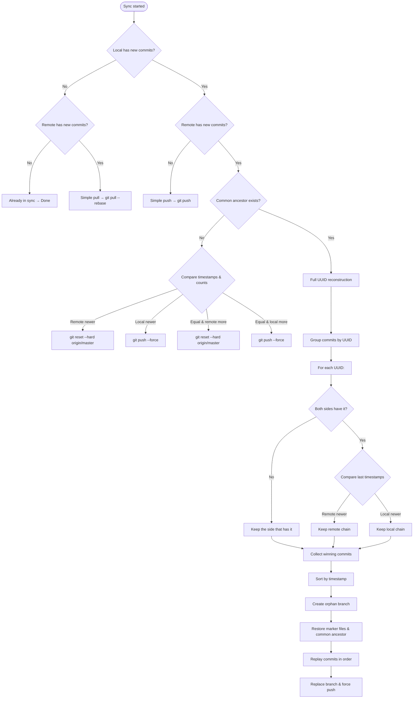

# Prior Art Disclosure: Deterministic UUID‑Level Git Synchronisation

## A Decision‑Based Operational Explanation with Code References

---

**Document Date:** June 2026  
**Author:** sjyotis  
**Status:** Public, Timestamped, Irrevocable  
**Repository:** github.com/sjyotis/thought-os  

---

## Preface

This document explains a synchronisation algorithm for distributed Git repositories from a **decision‑making perspective**. For every possible state of the local and remote repositories, the system makes a deterministic choice. Code references indicate the exact implementation of each decision.

The algorithm requires no user knowledge of Git. It produces linear history, never creates merge commits, and never asks the user to resolve conflicts. All decisions are based on commit metadata (hashes, timestamps, UUIDs) and never require decryption of the stored data.

The reader may verify every claim against the public source code.

---

## 1. Core Data Structures

### 1.1 Commit Metadata Extracted

For each commit, the system extracts:

| Field | Source Git Command | Purpose |
|-------|--------------------|---------|
| Commit hash | `git rev-list` | Unique identifier |
| UUID | Regex on commit message | Groups commits by logical item |
| Timestamp | `%ct` format | Conflict resolution authority |
| Author name/email | `%an`, `%ae` | Preserve attribution |
| Full message | `%B` | Commit message |
| Raw encrypted blobs | `git show <hash>:<file>` | `notes.json`, `files.json`, `structure.json` |

### 1.2 UUID Extraction Patterns

The system searches for UUIDs using three patterns, in order:

1. `uuid:<UUID>` (explicit metadata tag)
2. Standard RFC 4122 UUID (`xxxxxxxx-xxxx-xxxx-xxxx-xxxxxxxxxxxx`)
3. Timestamp‑based ID (`\d{14}`) (legacy format)

### 1.3 Security Commit Detection

A commit is classified as a **security commit** if its message contains `type: SECURITY:` or starts with `SECURITY:`. Security commits are handled separately from normal item commits.

---

## 2. Master Decision Flow

The entry point `sync_notebook()` evaluates the state and routes to the appropriate handler.

**Decision 1: Determine which sides have new commits**

```python
local_hashes = {c['hash'] for c in local_commits}
remote_hashes = {c['hash'] for c in remote_commits}
hashes_only_local = local_hashes - remote_hashes
hashes_only_remote = remote_hashes - local_hashes
```

**Decision logic:**

| Condition | Decision | Handler |
|-----------|----------|---------|
| No new commits on either side | Already in sync | Return `True` |
| New commits only on local | Simple push | `_simple_push()` |
| New commits only on remote | Simple pull | `_simple_pull()` |
| New commits on both sides | Diverged history | `_handle_diverged_history()` |

---

## 3. Decision 2: Simple Push (Only Local Has New Commits)

**Decision logic:** Stage encryption marker files, then push the current branch to `origin`.

**Outcome:** Remote is updated to match local.

---

## 4. Decision 3: Simple Pull (Only Remote Has New Commits)

**Decision logic:** Pull changes from `origin/master` with `--rebase` to keep history linear.

**Outcome:** Local is updated to match remote.

---

## 5. Decision 4: Diverged History (Both Sides Have New Commits)

### 5.1 Decision 4a: Common Ancestor Exists?

```python
has_common = self._has_common_ancestor(path)
```

| Condition | Sub‑decision |
|-----------|--------------|
| No common ancestor | Decision 4b (filter‑repo fallback) |
| Common ancestor exists | Decision 4c (full UUID reconstruction) |

### 5.2 Decision 4b: No Common Ancestor (Filter‑Repo Fallback)

This occurs after history rewriting (e.g., `git-filter-repo`). The system compares timestamps and commit counts.

**Priority order:**

| Priority | Condition | Decision |
|----------|-----------|----------|
| 1 | Remote timestamp > Local timestamp | Local replaced by remote (`git reset --hard`) |
| 2 | Local timestamp > Remote timestamp | Remote replaced by local (`git push --force`) |
| 3 | Timestamps equal, remote has more commits | Local replaced by remote |
| 4 | Timestamps equal, local has more commits | Remote replaced by local |

**Outcome:** The more recent (or larger) history wins; the other is discarded.

### 5.3 Decision 4c: Full UUID Reconstruction (Common Ancestor Exists)

This is the core of the algorithm. It operates in three sub‑decisions.

#### 5.3.1 Decision 4c(i): Build UUID Chains

Each commit is assigned to the UUID found in its message, producing a dictionary mapping UUID → list of commits (chronologically ordered).

```python
def _build_uuid_chains(self, commits):
    chains = defaultdict(list)
    for c in commits:
        chains[c['uuid']].append(c)
    return dict(chains)
```

#### 5.3.2 Decision 4c(ii): Resolve Conflicts Per UUID

For each UUID, the system compares the local and remote chains.

**Decision logic per UUID:**

| Local chain | Remote chain | Decision |
|-------------|--------------|----------|
| Exists | Empty | Keep all local commits |
| Empty | Exists | Keep all remote commits |
| Exists | Exists | Keep the chain whose **last commit** has the newer timestamp |

```python
local_last_ts = local[-1]['timestamp']
remote_last_ts = remote[-1]['timestamp']
if remote_last_ts > local_last_ts:
    winning.extend(remote)   # remote chain is newer
else:
    winning.extend(local)    # local chain is newer (or equal)
```

**Outcome:** A list of winning commits, one chain per UUID, each chain taken whole from either local or remote.

#### 5.3.3 Decision 4c(iii): Reconstruct Linear History

The system creates an orphan branch and replays the winning commits in timestamp order.

**Decision logic for reconstruction:**

1. **Backup marker files** (`.tn_test`, `.tn_recovery`, `.tn_password`) before any destructive operations.
2. **Create orphan branch** (`temp-linear-reconstruction`) with no history.
3. **Restore marker files** immediately on the new branch.
4. **Restore common ancestor state** (if any) by writing its raw blobs to the working directory.
5. **For each winning commit** (in ascending timestamp order):
   - Write the raw encrypted blobs (`notes.json`, `files.json`, `structure.json`) to disk.
   - Stage the files.
   - If the commit is a security commit, also write and stage the `.tn_*` files from that commit.
   - Create a new commit preserving the original author, timestamp, and message.
6. **Replace the original branch** with the reconstructed branch.
7. **Force push** to the remote.

**Outcome:** A perfectly linear history with no merge commits, no conflicts, and all content preserved.

---

## 6. Security Commit Handling

Security commits (password changes) are separated from normal commits before any conflict resolution.

| Step | Decision |
|------|----------|
| 1 | Separate security commits from normal commits. |
| 2 | Collect all security commits from both sides into a single list. |
| 3 | Deduplicate by SHA‑256 hash of the `.tn_recovery` blob content. |
| 4 | Keep all unique security commits (not just the newest). |
| 5 | Apply security commits during reconstruction by overwriting `.tn_*` files. |
| 6 | After reconstruction, if the newest security commit came from the remote, lock the notebook and notify the user. |

**Outcome:** Password changes propagate correctly without breaking decryption.

---

## 7. Complete Decision Tree



---

## 8. Prior Art Assertion

This document establishes prior art for the following concepts, all disclosed in public, timestamped materials as of June 2026:

1. **Commit hash comparison** to determine simple push/pull versus reconstruction.
2. **Common ancestor detection** to branch between filter‑repo fallback and full UUID resolution.
3. **Timestamp‑based conflict resolution** for UUID chains when a common ancestor exists.
4. **Per‑UUID chain comparison** – keeping whole chains from both sides when UUIDs differ.
5. **Security commit separation** – handling password changes independently from item changes.
6. **Security commit deduplication** by content hash (`.tn_recovery`).
7. **Orphan branch replay** with preservation of original author, timestamp, and commit message.
8. **Marker file preservation** across history rewrites.
9. **Force push after linear reconstruction** to make both sides identical.

The concepts disclosed herein are now part of the public domain. No party may obtain valid patent claims covering any concept described in this document.

---

## 9. Conclusion

This document explains a synchronisation algorithm as a series of deterministic decisions. Each decision is shown with its logic and code reference. The system never asks the user to resolve conflicts, never creates merge commits, and produces linear history. It works with any Git remote, handles encrypted content without decryption during conflict detection, and correctly propagates password changes.

The implementation is public, timestamped, and verifiable. This disclosure is made in the public interest. It may be cited in any patent examination, litigation, or prior art search.

The concepts described constitute prior art under **35 U.S.C. § 102(a)(1)** (US), **EPC Article 54(2)** (Europe), and **EPO G 1/23 (2025)** (public availability alone is sufficient). No party may obtain valid patent claims covering any concept disclosed herein.

---

**sjyotis**  
June 2026  
thought-os@protonmail.com  
github.com/sjyotis/thought-os
```
