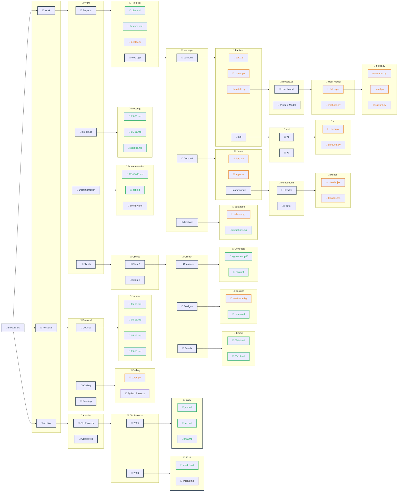

# The Infinite Notebook: A Structural Diagram of Thought OS

## Visualising Unlimited Depth in a Hierarchical Writing System

---

## Preface

This document presents a structural diagram of a Thought OS notebook hierarchy. The diagram shows how notebooks can contain subnotebooks, which contain more subnotebooks, creating indefinite depth.

No theoretical limit exists on depth. Each subnotebook can contain more subnotebooks, which can contain more, ad infinitum.

---

## The Smart Path Header (How Location Is Displayed)

When you are deep in the hierarchy, the system shows a truncated path with numbered segments.

**Key rules (from the code):**
- The root (or first visible notebook) is always numbered `[1]`
- Ellipsis (`...`) indicates truncated ancestors and has **no number**
- Numbering resets per screen and is sequential from the first visible segment
- The user can press `j1`, `j2`, `j3` to jump to any visible segment
- `jb` jumps back to previous location

**Examples:**

| Depth | Smart Path Display |
|-------|---------------------|
| Root | `[1]thought-os/` |
| Level 1 | `[1]thought-os/[2]Work/` |
| Level 2 | `[1]thought-os/[2]Work/[3]Projects/` |
| Level 3 | `.../[1]Work/[2]Projects/[3]web-app/` |
| Level 4 | `.../[1]Projects/[2]web-app/[3]backend/` |
| Level 5 | `.../[1]web-app/[2]backend/[3]models/` |
| Level 6 | `.../[1]backend/[2]models/[3]user/` |

**The user never sees an absolute path. Only relative position.**

---

## The Infinite Hierarchy Diagram



---

## How to Read This Diagram

| Shape | Meaning |
|-------|---------|
| 📓 Notebook | A container (can hold notes, files, and more notebooks) |
| 📄 Note | A regular text note |
| 🐍, ⚛️, 🎨, 🔧, etc. | File notes with syntax highlighting |
| Arrows | Parent → child relationship |

---

## What the Diagram Shows

The diagram shows a hierarchy with:

- **1 root notebook** (`thought-os`)
- **3 level 1 subnotebooks** (Work, Personal, Archive)
- **~30 subnotebooks** across levels 2-6
- **~35 notes** (regular text notes)
- **~20 file notes** (code, config, markup)

**But this is just a slice.** Every subnotebook could contain more. There is no enforced limit.

---

## How the Smart Path Works at Different Depths

| Depth | Location | Smart Path Display |
|-------|----------|---------------------|
| Root | `thought-os` | `[1]thought-os/` |
| Level 1 | `Work` | `[1]thought-os/[2]Work/` |
| Level 2 | `Projects` | `[1]thought-os/[2]Work/[3]Projects/` |
| Level 3 | `web-app` | `.../[1]Work/[2]Projects/[3]web-app/` |
| Level 4 | `backend` | `.../[1]Projects/[2]web-app/[3]backend/` |
| Level 5 | `models` | `.../[1]web-app/[2]backend/[3]models/` |
| Level 6 | `User Model` | `.../[1]backend/[2]models/[3]User/` |

---

## The Infinity Is Manageable

The user never sees the entire diagram. They see only one level at a time:

From root:
```
[1] Work
[2] Personal
[3] Archive
```

From Work:
```
[1] Projects
[2] Meetings
[3] Documentation
[4] Clients
```

From Projects:
```
[1] plan.md
[2] timeline.md
[3] deploy.py
[4] web-app
```

From web-app:
```
[1] backend
[2] frontend
[3] database
```

**Each screen shows only the immediate children. The depth is invisible until you descend.**

---

## Conclusion

The diagram shows a hierarchy that goes 6 levels deep. But there is no limit. Each subnotebook can contain more subnotebooks. The smart path header ensures the user never loses orientation.

**The user explores. The system navigates. The interface disappears.**

---

**End of Document**
---
